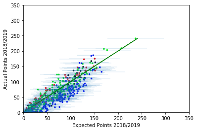

# Fantasy Football Model and Data for the 2019/2020 Premier League Season
----------------------------------

## Model Overviews

### Team Model
A Bayesian model for team's goals in a particular game, based on Dixon and Coles with form (points from previous 5 games) coefficients included.

### Player Model
A hierarchal Bayesian model for player's individual performances (minutes played, assists, goals and games played).

### Optimization Model
A simulator, based on both the team and player models, for the expected points of any given player for any set of fixtures.

The training for each model on historical data (see section below) is implemented in the corresponding `ipynb` scripts.

---------------------

## Training

The team model is trained initially on the previous three seasons of the Premier league (2016/2017, 2017/2018 and 2018/2019). The player model is trained initially on the previous two seasons of the Premier League (2017/2018 and 2018/2019). In both model, each season is time-weighted with respect to how recent it was. The team model is trained using MCMC. The hierarchal player models are trained using standard analytical Bayesian inference.

--------------------

## Model Updating

After each game-week, the team model parameters are updated by using a particle filter step, where the likelihood is based on the current game-week's results. The player model parameters are updated (incorporating a forgetting factor) using standard analytical Bayesian inference.

To run the update script:
- python models/update_models.py <csv_filename_for_gw_results> <number_of_particles> <save_to_csv?> <csv_filename_for_gw_player_performances> <csv_filename_for_all_season_player_data> <forgetting_factor>

--------------------

## Player Performance Sampling

Using the parameters (trained and updated as described above) for the team and player models, the performances of any player in a particular upcoming fixture can be sampled from the predictive posterior distributions associated with the models.

---------------------

## Analysis of Performance for the 2018/2019 Season

In this image, the accuracy of expected points (relative to actual player points) during the 2018/2019 season is shown - with standard error bars. Black points denote goalkeepers, blue points denote defenders, green points denote midfielders and red points denote forwards.

---------------------

## Draft Fantasy Football Data

In addition to the data from the Official FPL site, data specific to Draft Fantasy Football on every player from gameweek-to-gameweek can be gathered. To update cumulative season data, and collect data specific to a gameweek run the script:
- `python extract_gw_draft_data.py <game_week>`

----------------------------------

#### Data Credit:
Available from `https://github.com/vaastav/Fantasy-Premier-League/tree/master/data'
